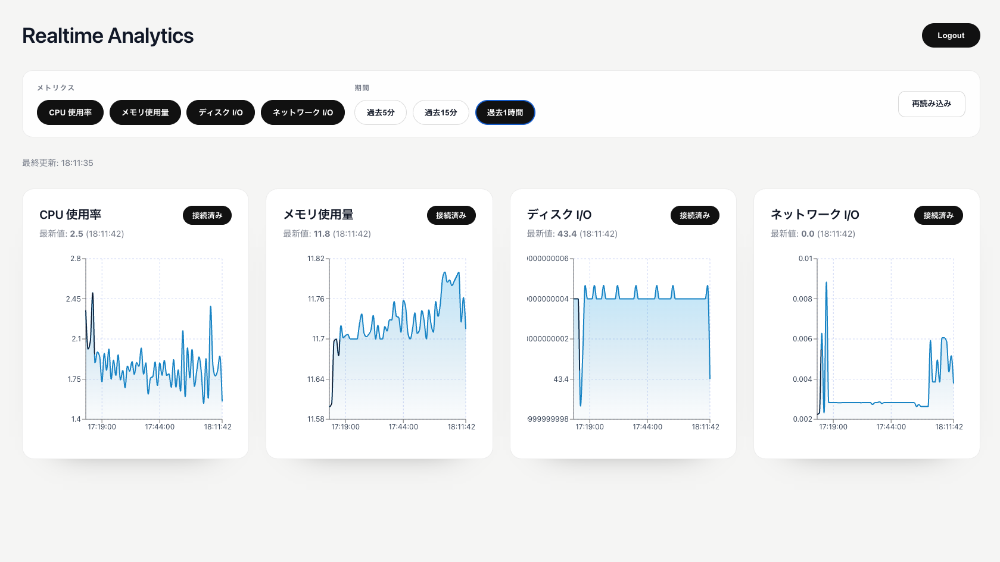
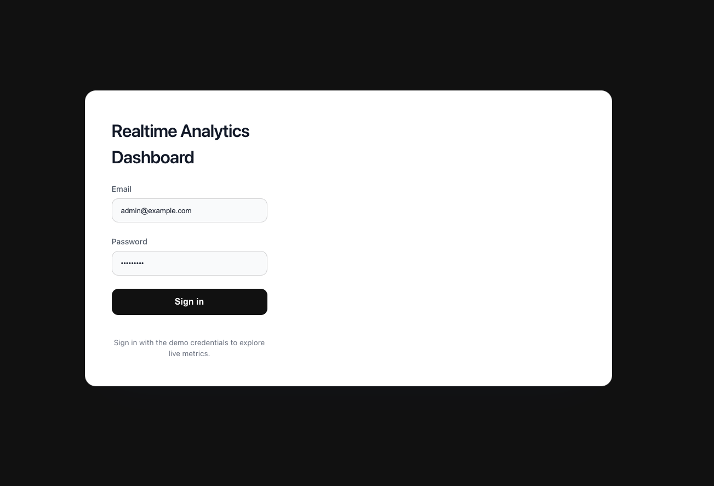
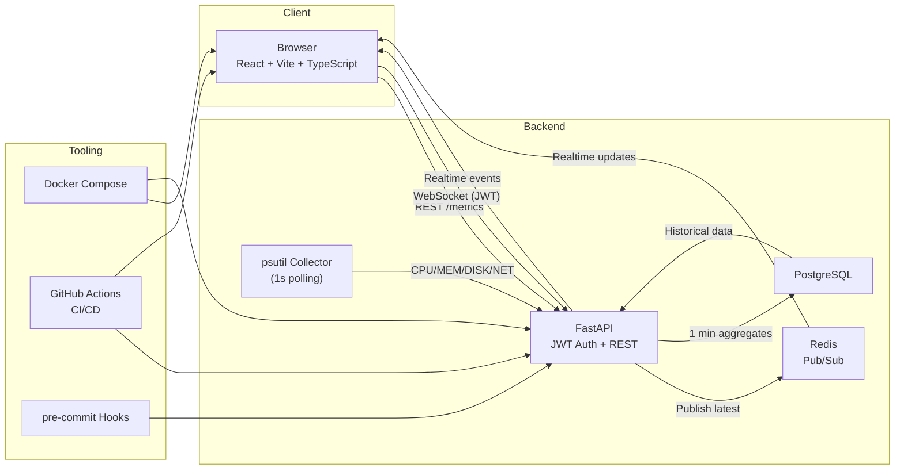

# Realtime Analytics Dashboard
> FastAPI × React × Redis Pub/Sub で、ローカルマシンのメトリクスをリアルタイム可視化するダッシュボード

[](https://github.com/Kumet/realtime-analytics-dashboard/actions/workflows/ci.yml)
[](https://github.com/Kumet/realtime-analytics-dashboard/actions/workflows/auto-merge.yml)
[](https://github.com/pre-commit/pre-commit)
[](./LICENSE)

<p align="center">
  
</p>

<p align="center">
  
</p>

## 🚀 Overview
- 1 秒ごとに psutil からシステムメトリクスを収集し、Redis を介してフロントに Push するリアルタイムダッシュボード。
- FastAPI + PostgreSQL で JWT 認証・履歴 API を提供し、React + TypeScript でミニマルな UI を実現。
- Docker Compose で一発起動でき、GitHub Actions / pre-commit / auto-merge による CI/CD が整備済み。

## 🧠 Tech Stack

| Layer        | Technologies                                                                 |
| ------------ | ---------------------------------------------------------------------------- |
| Frontend     | React 19, TypeScript, Vite, React Query, Recharts                            |
| Backend      | FastAPI, Pydantic, psutil, Redis Pub/Sub, WebSocket (JWT 認証)               |
| Data         | PostgreSQL 15, SQLAlchemy, Alembic                                           |
| Tooling      | Docker Compose, uv (Python), pnpm, pre-commit, GitHub Actions CI/CD          |

## 🏗️ Architecture



<sub>Mermaid ソース: [`docs/architecture.mmd`](docs/architecture.mmd)</sub>

## ⚙️ Setup

1. 環境変数をコピーして編集
   ```bash
   cp .env.example .env
   ```
   - `APP_ENV=local` / `METRICS_SOURCE=psutil` で psutil 収集が有効化されます。
2. Docker Compose で起動
   ```bash
   docker compose up --build
   ```
3. アクセス
   - Frontend: `http://localhost:5173`
   - Backend OpenAPI: `http://localhost:8000/docs`
   - Demo credentials: `admin@example.com` / `adminpass`

## 🔐 Auth & Endpoints

| Method | Path / Channel              | Auth | Description                                      |
| ------ | -------------------------- | ---- | ------------------------------------------------ |
| GET    | `/health`                  | ❌   | ヘルスチェック                                   |
| POST   | `/auth/login`              | ❌   | JWT アクセストークン発行（メール＋パスワード） |
| GET    | `/metrics?type=cpu`        | ✅   | 指定メトリクスの 1 分平均値を返却               |
| WS     | `/ws/metrics?type=cpu`     | ✅   | WebSocket (JWT) でリアルタイム値を配信          |

- WebSocket はクエリ `token` もしくは初回メッセージ `{ "token": "<JWT>" }` で認証。
- 1 分平均は PostgreSQL に保存、リアルタイム最新値は Redis Pub/Sub を経由。

## 🧪 Tests & CI/CD

| Category          | Command / Workflow                                                        | Notes                                           |
| ----------------- | -------------------------------------------------------------------------- | ----------------------------------------------- |
| Lint & format     | `pre-commit run --all-files`                                               | isort / ruff / prettier を一括実行              |
| Backend tests     | `cd src/backend && uv run pytest`                                          | Strict asyncio モードで API を検証               |
| Frontend tests    | `cd src/frontend && pnpm test --run`                                       | Vitest (または React Testing Library)           |
| Playwright E2E    | `cd src/frontend && pnpm exec playwright test`                             | ログイン〜ダッシュボード操作を自動化             |
| GitHub Actions CI | [ci.yml](https://github.com/Kumet/realtime-analytics-dashboard/actions/workflows/ci.yml) | backend / frontend / e2e の3ジョブ             |
| AI Review & Merge | [ai-review-fix.yml](https://github.com/Kumet/realtime-analytics-dashboard/actions/workflows/ai-review-fix.yml), [auto-merge.yml](https://github.com/Kumet/realtime-analytics-dashboard/actions/workflows/auto-merge.yml) | PR の AI レビュー・自動マージ                   |

## 🖼️ Screenshots / Demo

| Asset                              | Description                                   |
| ---------------------------------- | --------------------------------------------- |
| `docs/images/dashboard.png`        | ダッシュボード全景（ヒーロー画像）             |
| `docs/images/ui-login.png`         | ログイン画面（モノトーンテーマ）               |

## 🤝 Contributing

1. ブランチ戦略
   - `main`: 安定版
   - `feat/*`, `fix/*`, `docs/*`, `chore/*`, `test/*` など用途別プレフィックス
2. pre-commit をローカルで有効化
   ```bash
   pre-commit install
   ```
3. PR ポリシー
   - テンプレ: `.github/PULL_REQUEST_TEMPLATE.md`（※未整備の場合は Issue # を参照）
   - 1 PR 1 トピック、スクリーンショット必須（UI 変更時）
   - ラベル運用: `area/frontend`, `area/backend`, `kind/bug`, `kind/feature`, `needs-review`

## 🧯 Troubleshooting

| Symptom                                       | Fix                                                                 |
| --------------------------------------------- | ------------------------------------------------------------------- |
| Docker 起動後に `/auth/login` が 401 になる   | `.env` の `DEMO_USER_*` が一致しているか、DB を `docker compose down -v` で再初期化 |
| WebSocket が 403 / 1008 で落ちる             | フロントの LocalStorage `rad_token` を削除し再ログイン、`.env` の `SECRET_KEY` を確認 |
| フロントでグラフが更新されない               | Redis が起動しているか確認 (`docker compose ps redis`)、`.env` の `METRICS_SOURCE` を `psutil` に設定 |
| Playwright テストがブラウザ未取得で失敗       | `pnpm exec playwright install --with-deps` を先に実行               |
| `uv run pytest` で Redis 接続エラー           | テスト環境では `APP_ENV=test` に設定済みか確認、psutil コレクタが無効になっているかチェック |
